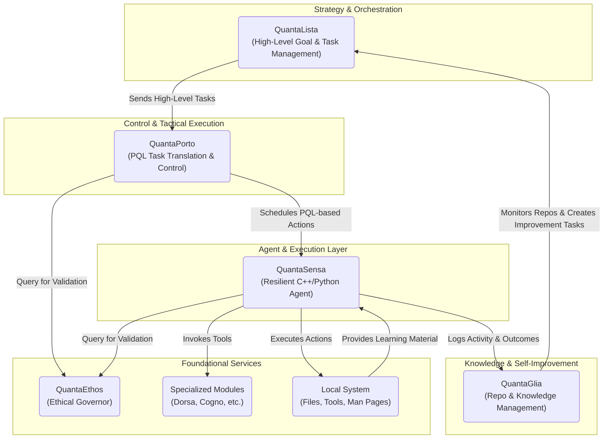

# System Architecture

## 1. Proposed High-Level Architecture

The system will be organized into layers of responsibility, from high-level strategy to low-level execution.



### Component Roles:

-   **QuantaLista (Strategist):** Manages the master project plan. It breaks down high-level goals into a queue of tasks with dependencies and priorities. It is the main entry point for human oversight.
-   **QuantaPorto (Commander):** The tactical controller. It consumes tasks from `QuantaLista`, translates them into the structured **PQL (QuantaPorto Language)**, and schedules them for execution by the agent.
-   **QuantaSensa (Field Agent):** The hands of the system. Its C++ parent controller is responsible for picking up a single scheduled task from `QuantaPorto` and invoking its Python agent to execute it resiliently.
-   **QuantaGlia (Librarian):** The knowledge manager. It periodically analyzes the entire ecosystem's repositories and activity logs to prune, archive, or spawn new tools and documentation, feeding its findings back into `QuantaLista` as new tasks.
-   **QuantaEthos (Conscience):** A mandatory validation service. Before executing any potentially impactful command, `QuantaSensa` and `QuantaPorto` must query `QuantaEthos` to get a go/no-go decision and a trust score.

## 2. Communication and Data Flow Strategy

To maintain simplicity and resilience, a file-based communication protocol is recommended for the core workflow.

-   **Asynchronous Tasking (File-based Queue):**
    1.  `QuantaLista` writes a new task as a unique JSON file (e.g., `task-123.json`) into a shared `/queue/pending` directory.
    2.  `QuantaPorto` monitors this directory. It picks up a task, moves it to `/queue/in_progress`, and generates a corresponding PQL file and shell command for `QuantaSensa`.
    3.  `QuantaSensa`'s parent controller executes the command. Upon completion, it writes a result file (e.g., `result-123.json`) to `/queue/completed` and deletes the task from `/queue/in_progress`.
    4.  `QuantaLista` monitors the `/queue/completed` and `/queue/failed` directories to update its master plan.

    **Example `task-123.json`:**
    ```json
    {
      "task_id": "task-123",
      "description": "Refactor the logging module in QuantaSensa.",
      "priority": "high",
      "dependencies": ["task-115"],
      "component": "QuantaSensa",
      "max_runtime_sec": 300
    }
    ```

-   **Synchronous Validation (CLI Service):**
    -   `QuantaEthos` will be packaged as a standalone executable. Other components will call it via a shell command, passing the proposed action as an argument. `QuantaEthos` will print a JSON object with the validation result to `stdout`, which the calling component will parse.
    -   **Example Call:** `quanta-ethos "rm -rf /critical/data"`
    -   **Example `stdout` Response:**
        ```json
        {
          "decision": "deny",
          "reason": "High-risk command pattern 'rm -rf' detected on a protected path.",
          "trust_score": 0.1
        }
        ```

-   **Centralized Logging:**
    -   Each component will maintain its own detailed log file (e.g., `sensa_agent.log`).
    -   For key events, each component will also append a single, structured line to a central `events.jsonl` file. This provides a unified stream for monitoring tools like `QuantaPulsa` and `QuantaAlarma`.
